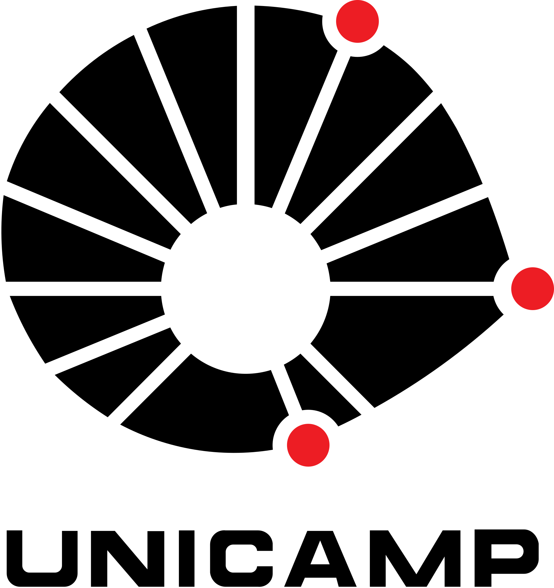
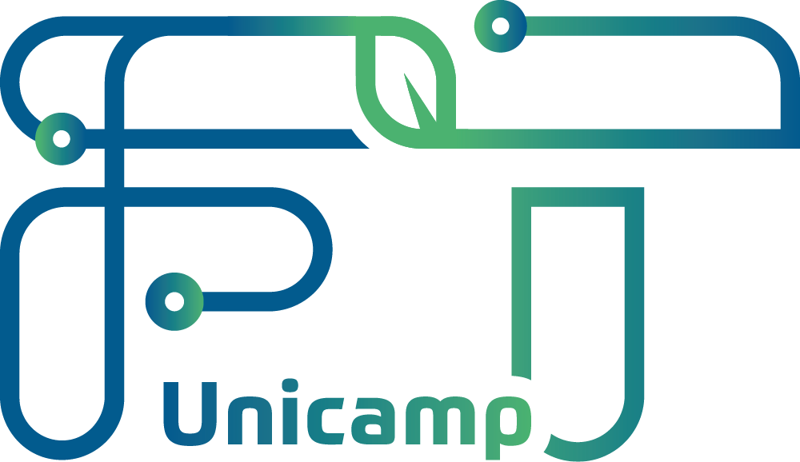

  
  

<h1 align="center">💰 FT Coin</h1>

  <strong>Projeto desenvolvido para a disciplina SI300 – Programação Orientada a Objetos I</strong> 
  Faculdade de Tecnologia da Universidade Estadual de Campinas  (FT/UNICAMP)

---

## 📖 Sobre o projeto

O **FT Coin** é um sistema de acompanhamento de carteira de moedas virtuais, com o objetivo de apurar ganhos e perdas ao longo do tempo.  
O sistema foi desenvolvido em **linguagem Java** e permite que o usuário realize operações de **gerenciamento de carteiras, registro de movimentações e geração de relatórios financeiros**.

Este projeto foi desenvolvido como parte da avaliação da disciplina **Programação Orientada a Objetos I**, com foco em arquitetura **MVC**, uso de boas práticas de programação, persistência de dados e organização de código orientado a objetos.

---

## ⚙️ Funcionalidades principais

- 💼 **Gerenciamento de carteiras** (inclusão, consulta, edição e exclusão)  
- 💱 **Registro de movimentações** (compra e venda de moedas virtuais)  
- 📊 **Relatórios financeiros** (saldo, histórico, ganhos e perdas)  
- 🔍 **Listagem de carteiras** (ordenadas por identificador ou nome)  
- 📅 **Consulta de histórico de movimentações por carteira**  
- 🌐 **Integração com oráculo** (cotação diária da moeda)  
- ❓ **Ajuda e créditos do sistema**

---

## 🧠 Requisitos não funcionais

- **Usabilidade:** interface de linha de comando (CLI) simples e organizada  
- **Desempenho:** resposta eficiente mesmo com múltiplas carteiras  
- **Confiabilidade:** integridade dos dados nas operações financeiras  
- **Portabilidade:** compatível com ambientes que suportam Java 8+  
- **Validação:** tratamento de erros e entradas inválidas  
- **Arquitetura:** padrão MVC e uso de DAO para persistência  

---

## ⚙️ Fluxo geral do sistema

1. O programa inicia executando a classe principal, exibindo o **menu principal**.  
2. O usuário escolhe uma das opções:
   - Gerenciar carteiras  
   - Registrar movimentações  
   - Consultar relatórios  
   - Acessar ajuda  
3. As operações são organizadas seguindo o padrão **MVC** (Model, View, Controller).  
4. Os dados podem ser persistidos em:
   - Memória local (simulação de banco)  
   - Banco de dados relacional (MariaDB)  

## 👥 Colaboradores

Todos os integrantes participaram do desenvolvimento do software.
- **Ana Julia Bandeira Maximo** — RA: 219528  
- **Bárbara Helóra Nigra Táparo** — RA: 270483  
- **Beatriz Moreira Cavalcanti** — RA: 222087  
- **Thiago Yuiti Azevedo Nakaba** — RA: 245357  
- **Raíssa Souza Santos** — RA: 284570  
- **Vinicius Romão Do Nascimento** — RA: 223339  
- **Yasmin Caetano Betioli** — RA: 296809  

> 💡 *Trabalho desenvolvido em grupo como parte da disciplina SI300 – Programação Orientada a Objetos I (FT/UNICAMP).*